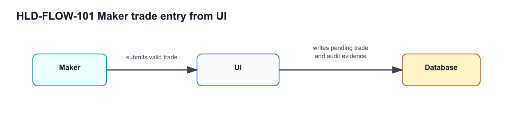
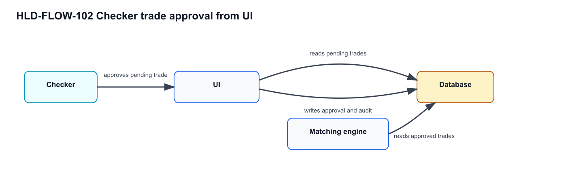

# High Level Design (HLD)

## Digital Trade Capture, Approval, Matching, and Audit Console

**Document ID:** QAMVP-HLD-MOCKTRADING-001  
**Version:** 2.0  
**Status:** Production-style source pack for mock trading SUT  
**Related documents:** [BRD](01-business-requirements-document.md) · [FRS](02-functional-requirements-specification.md) · [LLD](04-low-level-design.md)

---

## HLD §1. Architecture Overview

The mock trading SUT is an Angular single-page application backed by an in-browser mock API service. It uses route guards for authenticated navigation, local storage for mock persistence, and deterministic service methods for trade submission, approval, rejection, matching, price lookup, and audit event capture.

```text
Browser User
    |
    v
Angular Routes + Auth Guard
    |
    +-- Login Component
    +-- Navbar Shell
    +-- Trade Capture Component
    +-- Approval Queue Component
    +-- Dashboard Component
    +-- Trade List Component
    +-- Audit Component
    +-- User List Placeholder
    |
    v
MockApiService
    |
    +-- localStorage: current user
    +-- localStorage: trades
    +-- localStorage: audit events
    +-- deterministic ticker price table
```

---

## HLD §2. Component Model

| Component ID | Component | Responsibility | Related Requirements |
|---|---|---|---|
| HLD-COMP-001 | UI | Single-page app surface: authenticated, route-guarded navigation; trade capture; approval queue with four-eyes enforcement; dashboard and trade list; and the audit view. Subsumes the former per-screen components (login, guard, capture, queue, dashboard, audit). | REQ-FR-001 to REQ-FR-006, REQ-FR-010 to REQ-FR-016, REQ-FR-020 to REQ-FR-024, REQ-FR-032 to REQ-FR-036, REQ-FR-040 to REQ-FR-044, REQ-SEC-001, REQ-SEC-002 |
| HLD-COMP-005 | Matching engine | Matches approved opposite-side trades using ticker, quantity, and price; writes matched status back. | REQ-FR-030, REQ-FR-031 |
| HLD-COMP-010 | Database | Shared persistence for trades, audit events, and sessions; production analogue of the mock local-storage stores. The store every other component writes to and reads from. | DATA-TRADE-001, DATA-AUDIT-001, DATA-USER-001 |

### HLD §2.1 Component Glossary For Diagrams

Diagrams use business-readable names. This glossary resolves those names to stable component IDs during dependency extraction.

| Component ID | Diagram Name | Aliases |
|---|---|---|
| HLD-COMP-001 | UI | Browser UI; application UI; frontend; trade capture screen; approval queue; dashboard; audit view |
| HLD-COMP-005 | Matching engine | Matching service; match processor; lifecycle matcher |
| HLD-COMP-010 | Database | Trade store; persistence store; shared database; audit store |

---

## HLD §3. End-To-End System Flows

The following rows are the authored system-flow source of truth for the V1 baseline. They replace the earlier granular action rows such as user login, maker ticker selection, dashboard load, and audit review. The old HLD-FLOW-001 through HLD-FLOW-007 IDs are retained only for historical traceability and must not be reused with new meanings. The V1 baseline includes only UI-originated trade, matching, audit, and reporting behavior.

| Flow ID | Flow Name | Primary Actor/System | Trigger | Flow Narrative | Components Touched | Requirements Realized | Observable Outcome |
|---|---|---|---|---|---|---|---|
| HLD-FLOW-101 | Maker trade entry from UI | Maker | Maker submits a valid trade from the browser UI. | Maker authenticates in UI, opens trade capture, enters required trade economics, submits a valid trade, and the system writes a pending approval trade to Database with audit evidence. | UI; Database | BR-001; BR-002; BR-009; BR-011; REQ-FR-002; REQ-FR-010; REQ-FR-011; REQ-FR-012; REQ-FR-013; REQ-FR-015; REQ-FR-016; REQ-FR-041 | Pending approval trade exists; submit audit evidence exists; approval queue can display the trade. |
| HLD-FLOW-102 | Checker trade approval from UI | Checker | Checker approves an eligible pending trade. | Checker authenticates in UI, opens approval queue, reviews a pending maker trade, approves the trade, and the system updates Database state, audit evidence, reporting, and matching eligibility. | UI; Database; Matching engine | BR-003; BR-012; BR-013; BR-014; REQ-FR-003; REQ-FR-020; REQ-FR-021; REQ-FR-022; REQ-FR-023; REQ-FR-030; REQ-FR-035; REQ-FR-042; REQ-SEC-002 | Trade leaves pending queue; approval audit exists; matching may run for eligible approved trades. |
| HLD-FLOW-103 | Checker trade rejection from UI | Checker | Checker rejects an eligible pending trade. | Checker authenticates in UI, opens approval queue, reviews a pending maker trade, rejects the trade, and the system updates Database state, audit evidence, and reporting. | UI; Database | BR-003; BR-012; BR-013; BR-016; REQ-FR-003; REQ-FR-020; REQ-FR-021; REQ-FR-022; REQ-FR-024; REQ-FR-036; REQ-FR-043; REQ-SEC-002 | Trade leaves pending queue; rejected status and audit evidence are visible. |
| HLD-FLOW-104 | Approved trade matching lifecycle | System | A trade reaches approved lifecycle state. | Matching engine reads approved trades from Database, applies deterministic matching rules, links eligible opposite-side trades, and writes lifecycle state for reporting. | Matching engine; Database; UI | BR-005; BR-015; REQ-FR-030; REQ-FR-031; REQ-FR-032; REQ-FR-033; REQ-FR-034 | Eligible trades are matched; dashboard/trade list can show lifecycle status. |
| HLD-FLOW-107 | Audit and reporting review | Authorized user | User opens dashboard, trade list, or audit view. | UI reads Database state and displays lifecycle counts, trade status, notional, and controlled-action audit evidence. | UI; Database | BR-004; BR-006; BR-014; BR-016; BR-017; REQ-FR-032; REQ-FR-033; REQ-FR-034; REQ-FR-035; REQ-FR-036; REQ-FR-040; REQ-FR-041; REQ-FR-042; REQ-FR-043; REQ-FR-044 | Dashboard/list/audit views reflect persisted lifecycle and controlled-action evidence. |

### HLD §3.1 Flow Name Glossary For Diagrams

| Flow ID | Diagram Name | Aliases |
|---|---|---|
| HLD-FLOW-101 | Maker trade entry from UI | Maker trade entry; maker UI trade entry |
| HLD-FLOW-102 | Checker trade approval from UI | Checker approval; approval from UI |
| HLD-FLOW-103 | Checker trade rejection from UI | Checker rejection; rejection from UI |
| HLD-FLOW-104 | Approved trade matching lifecycle | Matching lifecycle; approved trade matching |
| HLD-FLOW-107 | Audit and reporting review | Reporting review; audit review |

### HLD §3.2 Diagram Extraction Views

Each embedded PNG diagram is labeled with its HLD-FLOW id and uses glossary-resolvable component names, so vision extraction maps each diagram to its flow (1:1) and resolves the drawn labels to stable component IDs. The flow membership is derived from the diagram title and visible component boxes; arrow labels carry operational dependency facts such as reads and writes. Diagrams are images only — matching how real-project HLD packs carry wiring.

#### HLD-FLOW-101 Maker Trade Entry From UI



#### HLD-FLOW-102 Checker Trade Approval From UI



---

## HLD §4. Integration and Persistence Boundaries

| Boundary | Current Mock Implementation | Production Analogue | Test Design Impact |
|---|---|---|---|
| Identity | In-memory/local-storage current user via `MockApiService`. | IAM/session service. | Tests validate route and role behavior, not enterprise auth. |
| Trade persistence | Browser local storage `mock_trading_trades`. | Trading database or service API. | Tests must clear local storage for deterministic setup. |
| Audit persistence | Browser local storage `mock_trading_audit_events`. | Immutable audit store. | Tests validate row content and known reject event-type defect. |
| Market data | Deterministic price map in service. | Market data provider/cache. | Tests assert known prices for supported tickers. |
| Matching | Synchronous local function. | Matching or lifecycle service. | Tests can create exact opposite-side pairs deterministically. |
| QA retrieval | Markdown/DOCX chunks embedded in Postgres pgvector. | Enterprise knowledge/retrieval store. | Source tables should be chunked with heading and row metadata. |

---

## HLD §5. Control Design

| Control ID | Design Control | Enforcement Point | Evidence |
|---|---|---|---|
| CTRL-AUTH-001 | Protected route access requires current user. | Auth guard. | Redirect/block behavior from protected routes. |
| CTRL-SOD-001 | Submitter cannot approve or reject own trade. | Queue component and `MockApiService` decision methods. | Disabled controls or false service response. |
| CTRL-VAL-001 | Required trade fields and numeric minimums are enforced before submit. | Reactive form validators. | Disabled submit state and form control validity. |
| CTRL-MATCH-001 | Matching uses deterministic equality conditions. | `runMatching`. | Matched status and reciprocal matched-with values. |
| CTRL-AUD-001 | Controlled actions produce audit evidence. | `recordAuditEvent`. | Audit Trail rows. |

---

## HLD §6. pgvector Retrieval Role

pgvector stores each ingested source chunk as a normalized embedding and ranks semantically similar chunks for generation and investigation. Exact SQL tables answer deterministic questions such as "show TC-007"; full-text search supports literal IDs and terms; pgvector supports business-intent retrieval such as "GTC expiry control" or "reject audit evidence" when the user does not know the exact section or requirement ID.

---

## HLD §7. Architecture Decision Record Extracts

| ADR ID | Decision | Alternatives Considered | Decision Rationale | Consequence |
|---|---|---|---|---|
| ADR-MOCK-001 | Use Angular SPA plus MockApiService for the SUT. | Real backend, static HTML prototype. | Provides enough behavior for browser automation without infrastructure complexity. | Business state is local and reset-sensitive. |
| ADR-MOCK-002 | Use local storage for trades and audit events. | Postgres API, in-memory only. | Allows deterministic review after page navigation and refresh. | Test setup must clear keys for isolation. |
| ADR-MOCK-003 | Keep deterministic price map in service. | Random prices, external market data. | Repeatable tests need stable expected values. | Price behavior is not representative of production market-data controls. |
| ADR-KB-001 | Store document chunks in Postgres with pgvector. | Keyword-only search, flat file retrieval. | Business queries often use different terms than source documents. | Chunk quality and table extraction directly affect retrieval quality. |

---

## HLD §8. Operational Run Context

| Concern | Mock Run Position | Bank-Style Control Implication |
|---|---|---|
| Environment | Local developer or QA workstation. | Treat evidence as test-drive evidence, not production audit record. |
| Data reset | Local storage clear before tests. | Test data namespace is simulated by clean browser state. |
| Latency | Mock service uses visible delays. | Tests need waits for loading/toast states rather than fixed sleeps. |
| Failure handling | Minimal error handling in UI. | Negative tests focus on supported validation and known defects. |
| Observability | UI evidence plus generated reports. | Allure/runner evidence can wrap the mock app results in later phases. |

---

## HLD §9. Retrieval and Ingestion Architecture

| Layer | Responsibility | Notes for Implementation |
|---|---|---|
| Source documents | Provide messy but traceable SDLC text, tables, exceptions, and annexes. | Markdown remains source; DOCX is distribution artifact. |
| Chunking | Preserve heading path, paragraph content, and table-row context. | DOCX tables must not be dropped. |
| Entity extraction | Capture BR, REQ, HLD, LLD, control, data, scenario, and test-case identifiers. | Existing extractors may infer some IDs from content. |
| Embedding | Convert each chunk to a 384-dimensional vector. | Table rows need enough surrounding text to be meaningful. |
| Retrieval | Combine structured lookup, full-text search, and vector similarity. | Vector search helps when query phrasing differs from source labels. |

---

## HLD §10. Annex A — Control Ownership and Residual Risk

This annex is part of the HLD rather than a separate controls document. It is retained here so architectural control ownership is ingested through the four-document release workflow.

| Control ID | Control Objective | Risk Addressed | Owner | Enforcement Point | Evidence |
|---|---|---|---|---|---|
| CTRL-AUTH-001 | Protected functions require authentication. | Unauthenticated trade or evidence access. | Engineering | Auth guard | Redirect/block result and login page evidence. |
| CTRL-SOD-001 | Maker cannot decide own trade. | Inadequate segregation of duties. | Middle Office Control | Queue component and MockApiService decision guard | Disabled approve/reject controls or service denial. |
| CTRL-VAL-001 | Trade submission requires valid business fields. | Invalid instruction entering workflow. | Front Office Operations | Reactive form validators | Disabled submit button and validation state. |
| CTRL-PRICE-001 | Ticker price is populated consistently for deterministic tests. | Non-repeatable trade totals. | QA Engineering | Mock price map | Price field and total value evidence. |
| CTRL-MATCH-001 | Matching uses deterministic equality rules. | False positive or false negative match evidence. | Operations Control | Matching routine | Matched statuses and reciprocal TX-IDs. |
| CTRL-AUD-001 | Controlled actions are auditable. | Missing evidence for review. | Compliance Technology | Audit event store and Audit page | Audit table rows. |

### HLD §10.1 Annex A.1 — Residual Risk Register

| Risk ID | Residual Risk | Compensating Evidence | Owner |
|---|---|---|---|
| RR-001 | Mock role model does not represent enterprise entitlement management. | Route guard and role-display tests only claim mock coverage. | Engineering |
| RR-002 | Local storage can be cleared outside application workflows. | Test setup controls local storage explicitly. | QA Engineering |
| RR-003 | Audit event taxonomy is incomplete. | Known defect register and detail-text assertions. | Compliance Technology |
| RR-004 | Semantic retrieval can return nearby but not authoritative chunks. | Structured requirement/test-case lookup remains first path for exact IDs. | QA Lead |

## HLD §11. Shared Database

Trades, audit events, and sessions are persisted in a shared server-side Database (HLD-COMP-010), the production analogue of the mock local-storage stores. The UI writes captured trades into it; the UI and the Matching engine read from it.

```text
UI (HLD-COMP-001) ---writes---> Database (HLD-COMP-010)
                                |
                                +--read--> Matching engine (HLD-COMP-005)
                                +--read--> UI (dashboard / audit)
```

### HLD §11.1 Shared store writers and readers

The UI writes each submitted maker trade to the Database. The Matching engine reads approved trades from the Database. The UI reads trades and audit events from the Database.
